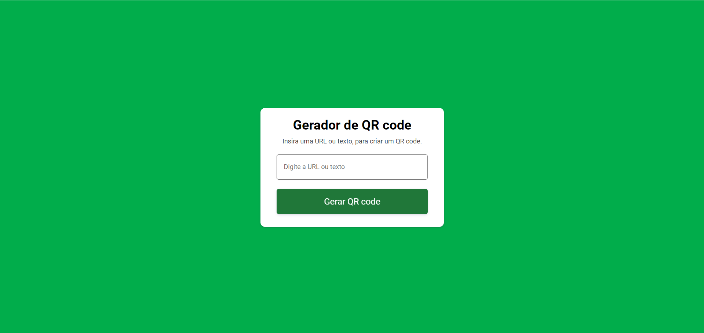

# Gerador de QR Code

**Visão Geral**  
O projeto *Gerador de QR Code* oferece uma solução prática e eficiente para criar QR codes. Esta ferramenta interativa permite aos usuários gerar QR codes personalizados de forma rápida e fácil usando uma API especializada.

**Funcionalidades**

- **Geração de QR Code Personalizado:** Crie QR codes com base nas informações fornecidas pelo usuário, como URLs, textos ou outros dados.
- **Interface Amigável:** Uma interface simples e intuitiva para geração fácil de QR codes.
- **Integração com API Externa:** Utiliza uma API para garantir a geração precisa e de alta qualidade dos QR codes.
- **Visualização Imediata:** Exibe o QR code gerado em tempo real.
- **Opção de Download:** Permite aos usuários baixar a imagem do QR code gerado para uso conveniente.

Se você precisa de um QR code para um site, evento ou qualquer outro propósito, este gerador oferece uma experiência rápida e sem complicações.

<a href="https://vinicius-rodriguess.github.io/QR-Code-Generator/" target="_blank">Clique aqui para testar o projeto!</a>

# QR Code Generator

**Overview**  
The *QR Code Generator* project provides a practical and efficient solution for creating QR codes. This interactive tool allows users to generate custom QR codes quickly and easily using a specialized API.

**Features**

- **Custom QR Code Generation:** Create QR codes based on user-provided information such as URLs, text, or other data.
- **User-Friendly Interface:** A simple and intuitive interface for easy QR code generation.
- **External API Integration:** Utilizes an API to ensure accurate and high-quality QR code generation.
- **Immediate Visualization:** Displays the generated QR code in real-time.
- **Download Option:** Allows users to download the generated QR code image for convenient use.

Whether you need a QR code for a website, event, or any other purpose, this generator offers a quick and hassle-free experience.
<a href="https://vinicius-rodriguess.github.io/QR-Code-Generator/" target="_blank">
Click here to test the project!</a>

